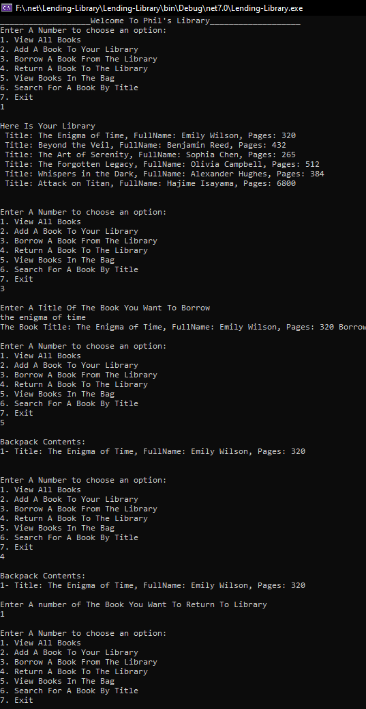

# Lending-Library

## what it is
it is a console application the main goal for this application
to add book for the library and you can borrow any book to your back and you can return it to the library
and there is a user inter face descripe it and it 
easy to use and faster 

## how it looks like :camera:

- 

## how to use it and relevant details.

- first you will got  a welcome message that contains an options
- so each of these option will make a function for you to complete your work
- the fist option will show you all books found in the library 
- and by default we added some initial books 
- and then you can add a book 
- and it will ask for the title and firstname and lastname 
- and number of pages for this book 
- and you can borrow a book form the libaray by choossing the book title 
- and once you borrowd the book it will be in your bag automaticaly 
- we have also a return method that will return the book you borrow from the library which is in your bag now 
to get it back to the library and remove it from your bag
and you can choose the book you want to return by enter the number of this book
and it will get back to the library
- you can view the bags books you own 
- and finally you can search for a book title by entering the title for the nook 
- and you will know if it exist or not 